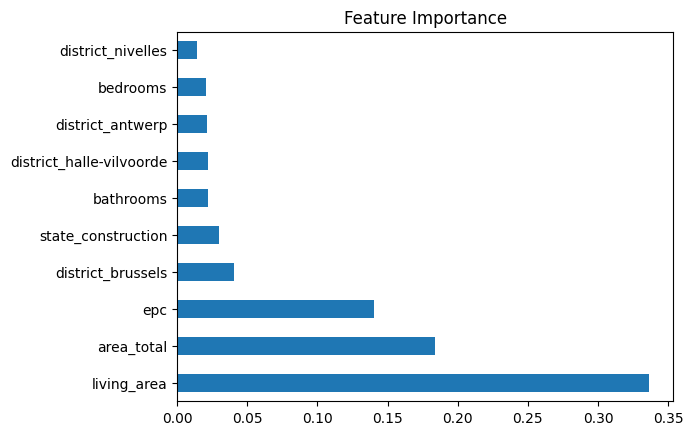
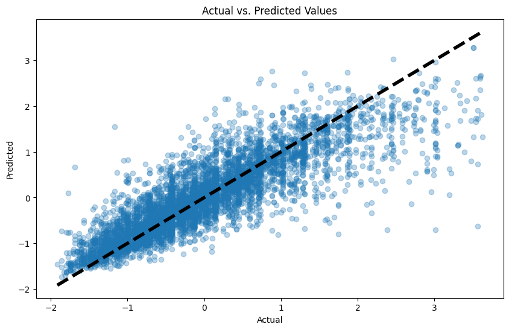

# Model Card: Real Estate Price Prediction for Immo Eliza

## Project Context

Developed for Immo Eliza, this model aims to assist both buyers and sellers in the Belgian real estate market by predicting property values based on a range of features.

## Data

- **Dataset**: Trained on 30,554 property listings in Belgium, focusing on houses.
- **Target**: Listing price of each property.
- **Features**: Includes bedrooms, property type, location, living area, garden/terrace presence, etc.

## Model Details

- **Tested Models**: Linear Regression, Random Forest, Polynomial Regression.
- **Chosen Model**: Random Forest was selected for its balance of performance and interpretability.

## Performance

The Random Forest model achieved an R² score of 0.72, explaining 72% of the variance in property prices. This was determined to be satisfactory for the project's needs.

  
_Figure 1: Feature Importances of the Random Forest Model_

_Comparison of Actual vs. Predicted Property Prices_

## Limitations

- **Data Quality**: Model accuracy relies heavily on data quality. Unique properties may be less accurately predicted.
- **Time-Sensitive Factors**: Does not consider market trends or economic conditions.
- **Region Specific**: Trained on Belgian data, which may not generalize to other regions.

## Future Work

- Explore more advanced models and feature engineering techniques.
- Investigate the impact of including time-sensitive features on model accuracy.

## Usage Guide

### Dependencies

Install dependencies from `requirements.txt`. Main libraries: `pandas`, `scikit-learn`, `joblib`, `numpy`.

### Training the Model

Run `train_rf.py` to train the model. Ensure `preprocessing.py` is accessible.

### Generating Predictions

Use `predict_rf.py` with new data in the same format as the training set to generate predictions.

## Maintainers

For inquiries or further information, reach out to [Yanina Andriienko](https://www.linkedin.com/in/yanina-andriienko-7a2984287/).
