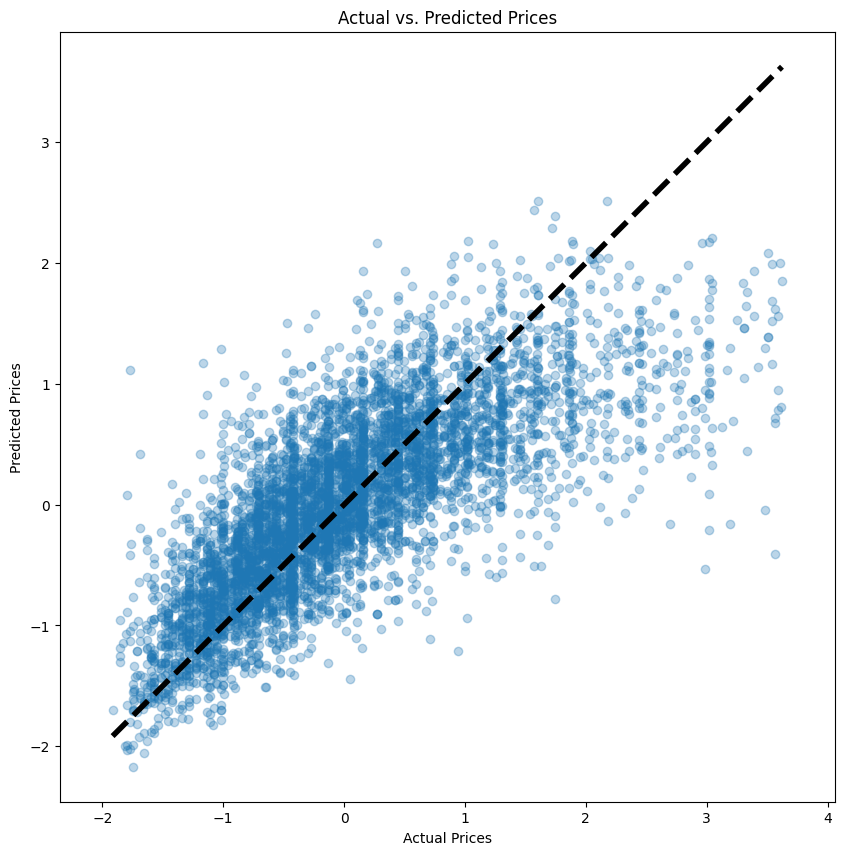

# Model card

## Project context

This model was developed for Immo Eliza, a real estate company, to predict the prices of real estate properties in Belgium. The aim is to provide a tool that can estimate property values based on various features of the properties, aiding both buyers and sellers in the real estate market.

## Data

- Input Dataset: The model was trained on a dataset comprising 30554 property listings in Belgium, covering houses.
- Target Variable: The target variable for this project is price, representing the listing price of each property.
- Features: The model considers various features including the number of bedrooms, property type, location, living area size, presence of a garden or terrace, and more.

## Model details

- Models Tested: Throughout the project, several models were evaluated including Linear Regression, Random Forest, and Polynomial Regression.
- Final Model Chosen: The final model selected for deployment is a Linear Regression model due to its simplicity, interpretability, and satisfactory performance.

## Performance

The Linear Regression model achieved an R² score of 0,57 on the test set, indicating that 57% of the variance in property prices can be explained by the model.

## Limitations

- The model's accuracy is highly dependent on the quality and comprehensiveness of the input data. Properties with unique characteristics might not be predicted accurately.
- The current model does not account for time-sensitive factors such as market trends or economic conditions which can affect property prices.
- The model is trained on data from Belgium and might not generalize well to other regions.

## Usage

- Dependencies: Ensure all dependencies are installed as specified in requirements.txt. Key dependencies include pandas, scikit-learn, joblib, and numpy.
- Training the Model: Run train.py to train the model. Ensure preprocessing.py is in the same directory or adjust the import path accordingly.
- Generating Predictions: Use predict.py with new data to generate price predictions. The new data should follow the same structure as the training data.

## Maintainers

- For questions, issues, or further information, please contact https://www.linkedin.com/in/yanina-andriienko-7a2984287/.
